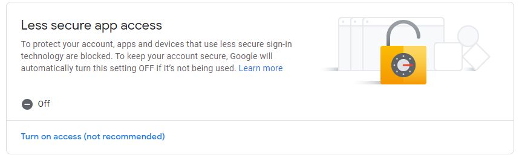
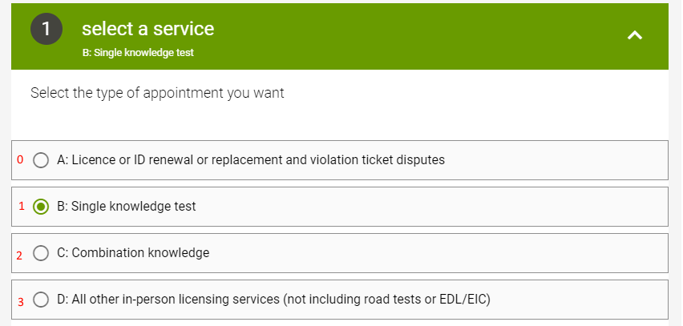

# ICBC Web Booking Availability Checker

This is a small program to check ICBC's available times based on their Qmatic web form [here](https://onlinebusiness.icbc.com/qmaticwebbooking/#/). The purpose this was created was due to the frustratingly limited capacity that ICBC has for bookings per day to a point that people have to constantly refresh their form to check for available dates.

## Set up

Setup of this package is relatively simple.

### Gmail Account (optional)

This tool can be used with a gmail account to send email notifications. To do this, 2FA must be disabled. Additionally, the account security must be lowered by removing this option:



### Puppeteer (required)

Make sure puppeteer is installed correctly by following google's guide [here](https://developers.google.com/web/tools/puppeteer/get-started)

### Package dependency install (required)

Install remaining dependencies:

```sh
npm install
```

In the `config/config.yml` section, the file shows what the config should look like. Additionally, if setting the email notification option to true, you must also configure `config/email_config.yml`

## Setting up config.yml

Most of the fields in the file are pretty self explanatory However, I will still make an effort to outline them.

**StepN:**

The `N` refers to which step of the form the selection is in. The example shown below is of `step1` of the ICBC form. Also notice that the options are indexed starting from 0 instead of 1.



**Interval:**

The interval in *milliseconds* represents the amount of delay between each check on the ICBC website. Since we don't want to be hammering their service, it's best to leave this to 5 minutes.

**StartDate / EndDate:**

The start date to be searched through in `YYYY-MM-DD` format

**ShouldSendEmail:**

true / false value as a string indicating whether to send an email or not

## Usage

This program can be run in the background by simply running it with:

```sh
node app.js
```

## Suggestions

Feel free to let me know of any improvements you would like to see!
